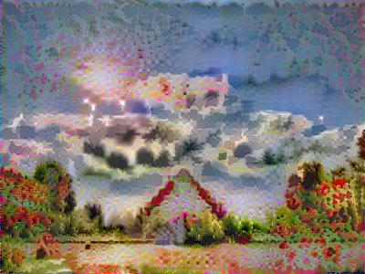
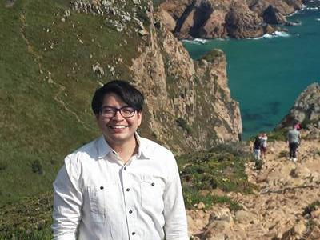
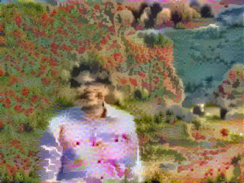
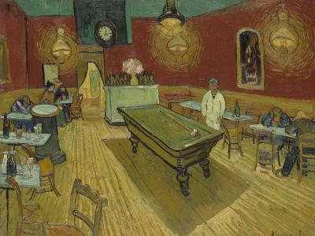
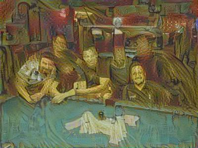

# Art_Generator_with_Neural_Style_Transfer

This is a Neural Style Transfer, a deep learning algorithm (Gatys et al. 2015, link: https://arxiv.org/abs/1508.06576).
This algorithm merges two images into one, based on a content image and style image, to create a generated image. 

Check out some examples of what this algorithm can do.

Style Image

Content Image

Generated Image

Style Image

Content Image

Generated Image

Style Image

Content Image

Generated Image

